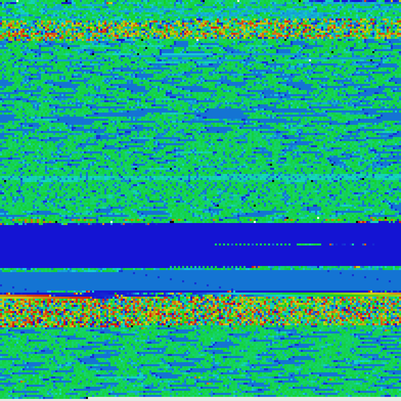

# imageZIP

This is a small python package to archive (encrypt) files and directories into a single image file. 

This project is made just for fun, it has no practical use, output "ZIP" image will always have the same or greater file size than it's content. Also, this is not easy-to-scan like QR codes.

Algorithm is pretty easy. If folder to zip is chosen, it will iterate through all folders and files inside it. If folder is found, it will write relative path of folder in bytes and add special folder delimiter at the end. If file is found, it will write it's relative path and name in bytes, add special file delimiter and then write all it's content in bytes with additional second file delimiter. When bytes array is ready to go, it will build an image, where individual pixels representing particular byte number.

## Example



This is an "imageZIP archive", containing this whole "imageZIP" repository.
 
It was created with ```imageZIP.zip("some path/imageZIP/", scale=4)```.

You can actually download this image and unzip it with ```imageZIP.unzip("some path/demo_zip.png", scale=4)```, it will create "imageZIP" folder with all repository files.

## How to use

To download this package, you can use ```pip install imageZIP```.

Then go to python terminal and write ```import imageZIP```.

Then you can use 2 available functions:

- ```imageZIP.zip(path: str, scale: int = 1, color_mode: str = 'heat')```;
- ```imageZIP.unzip(path: str, scale: int = 1, color_mode: str = 'heat')```.

Where:
- ```path``` - path (```str```) to a single file or whole directory to "zip", or image file to "unzip";
- ```scale```* - scale (```int```) of input or output image file. Default: ```1```;
- ```color_mode```* - color mode (```str```) of input or output image file. Default: ```"heat"```.

> *not necessary attributes, which can be omitted.

#### Notes:

- For ```zip``` and ```unzip``` you have to provide same ```scale``` and ```color_mode``` settings;
- Available ```color_mode```s are: ```bw```, ```heat```, ```heat_toxic```, ```rainbow```, ```red```, ```blue```;
- ```scale``` is have to be ```int >= 1```;
- ```path``` can be absolute or relative;
- If a good rectangle image can't be created, output image will be a square with some empty pixels at the end.
